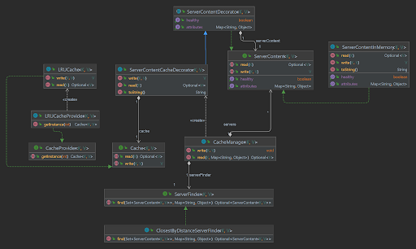

# Ormuco

<!-- TOC -->
* [Ormuco](#ormuco)
  * [Project Structure](#project-structure)
  * [Question A](#question-a)
    * [Statement](#statement)
    * [Solution](#solution)
  * [Question B](#question-b)
    * [Statement](#statement-1)
    * [Solution](#solution-1)
  * [Question C](#question-c)
    * [Statement](#statement-2)
    * [Solution](#solution-2)
      * [Cache Service Overview](#cache-service-overview)
      * [Requirements to compile and execute](#requirements-to-compile-and-execute)
      * [Integration and use](#integration-and-use)
      * [Demo](#demo)
      * [Limitations](#limitations)
      * [Improvements](#improvements)
<!-- TOC -->

## Project Structure

This a multi-module project build with maven and each is described below:

* [cache-service-client](cache-service-client): The purpose of this module is to illustrate how the **cache-service-library** can be used and integrated into a few steps.
* [cache-service-library](cache-service-library): This module contents the cache-service-library implementation 
* [cache_service_exercise](cache_service_exercise): This module holds the implementation of the question A and B in order to keep clean the library implementation.


## Question A

### Statement

Your goal for this question is to write a program that accepts two lines (x1,x2) and (x3,x4) on the x-axis and returns whether they overlap. As an example, (1,5) and (2,6) overlaps
but not (1,5) and (6,8).

### Solution

The code implementation is [here](cache_service_exercise/src/main/java/com/cache/LineOverlappingChecker.java) and the test
cases [here](cache_service_exercise/src/test/java/com/cache/LineOverlappingCheckerTest.java)

## Question B

The goal of this question is to write a software library that accepts 2 version string as input and returns whether one is greater than, equal, or less than the other. As an
example: “1.2” is greater than “1.1".
Please provide all test cases you could think of.

### Statement

The code implementation is [here](cache_service_exercise/src/main/java/com/cache/NumberComparator.java) and the test
cases [here](cache_service_exercise/src/test/java/com/cache/NumberComparatorTest.java)

### Solution

## Question C

### Statement

At Ormuco, we want to optimize every bits of software we write. Your goal is to write a new library that can be integrated to the Ormuco stack. Dealing with network issues
everyday, latency is our biggest problem. Thus, your challenge is to write a new Geo Distributed LRU (Least Recently Used) cache with time expiration. This library will be used
extensively by many of our services so it needs to meet the following criteria:

1. Simplicity. Integration needs to be dead simple.
2. Resilient to network failures or crashes.
3. Near real time replication of data across Geolocation. Writes need to be in real time.
4. Data consistency across regions
5. Locality of reference, data should almost always be available from the closest region
6. Flexible Schema
7. Cache can expire

### Solution

#### Cache Service Overview

This library is designed to provide cache capability to any existing server, furthermore, this library includes some extension points in order to facilitate the uses and integration with existing applications such as a server finder strategy, cache implementation, and retry mechanism to mitigate latency issues.

Below the main components are described:

* **Cache Manager**: This is the core component, and It is responsible for providing the cache feature, assigning the service finder strategy, and the Cache implementation, the cache manager has two public operations:
  * **Write**: This method encapsulates the work needed to write simultaneously into all servers registered and add to the cache. If a failure happens there is a retry implemented with resilience4j in order to improve the resilience of the library.
  * **Read**: This method searches for the best suitable server, and then fetches the value either from the cache or the server accordingly. If a failure happens there is a retry implemented with resilience4j in order to improve the resilience of the library.
* **Server Content**: This is an abstraction that helps the users of the library to work with their existing servers, further,  Metadata(attributes)could be added in order to facilitate later features. An in memory definition [ServerContentInMemory](cache-service-library/src/main/java/com/core/server/ServerContentInMemory.java)  is in the library 
* **Server Finder**: A server finder defines the strategy to look up the best server to resolve a request, by default the library supplies an implementation[ClosestByDistanceServerFinder](cache-service-library/src/main/java/com/core/server/ClosestByDistanceServerFinder.java) that calculates the closest server based on coordinates
* **Cache Provider**: This component lets the user decide which Cache implementation they want to use, as part of the library LRU Cache algorithm implementation[LRUCache](cache-service-library/src/main/java/com/core/cache/LRUCache.java) is included.

Finally, The below class diagram shows the library structure and how the components are connected.

* 

#### Requirements to compile and execute

This library was built using Java 17 and maven 3.6.3.

#### Integration and use 

This library uses [Maven](https://maven.apache.org/) as build tool.

1. Clone the project, compile and package the [cache-service-library](cache-service-library), after that a new jar will be published in local repository or artifactory(additional configurations are required)
2. Add the maven dependency into the project 
``` xml
        <dependency>
            <artifactId>cache-service-library</artifactId>
            <groupId>com.cache</groupId>
            <scope>compile</scope>
            <version>${version}</version>
        </dependency>
```
3. Use the [CacheManager](cache-service-library/src/main/java/com/core/CacheManager.java) as needed, a sample is added [here](cache-service-client/src/main/java/com/client/DemoContentManager.java).

``` java
        CacheManager<String, String> cacheManager = new Builder<String, String>().onDefaults(
            ServerHelper.getServerContents());
        // use case
        cacheManager.write("key1", "value");
        cacheManager.read("key1", ServerHelper.MONTREAL_LOCATION);
```

#### Demo

To convince a script called [run_demo.sh](run_demo.sh) was added, This script executes a fat jar [cache-demo.jar](demo/cache-demo.jar), which was generated from [cache-service-client](cache-service-client) in order to help to demonstrate how to use the library. 
In order to execute the script make sure that you granted execution permission.
Below is show the output.

```console
$ ./run_demo.sh
INFO  ServerContentCacheDecorator:51 - Writing value into the cache for server [ServerContentInMemory{name='server toronto', attributes={LATITUDE=43.65, LONGITUDE=30}}] 
INFO  ServerContentCacheDecorator:51 - Writing value into the cache for server [ServerContentInMemory{name='server new york', attributes={LATITUDE=40.71, LONGITUDE=74}}] 
INFO  ServerContentInMemory:28 - Server [server new york] receive a request to write with key: [key1] and value: [value]
INFO  ServerContentInMemory:28 - Server [server toronto] receive a request to write with key: [key1] and value: [value]
INFO  ServerContentCacheDecorator:51 - Writing value into the cache for server [ServerContentInMemory{name='server montreal', attributes={LATITUDE=45.5, LONGITUDE=73.56}}] 
INFO  ServerContentInMemory:28 - Server [server montreal] receive a request to write with key: [key1] and value: [value]
INFO  CacheManager:39 - Searching for the closest server available with requestAttributes [{LATITUDE=45.5, LONGITUDE=73.56}].
INFO  ClosestByDistanceServerFinder:42 - Closest server found [ServerContentCacheDecorator{, serverContent=ServerContentInMemory{name='server montreal', attributes={LATITUDE=45.5, LONGITUDE=73.56}}}]
INFO  ServerContentCacheDecorator:34 - Reading value cached from the server [ServerContentInMemory{name='server montreal', attributes={LATITUDE=45.5, LONGITUDE=73.56}}].
```
#### Limitations
* This library was created as a maven multi-module project in order to make easier the presentation of the deliverables, however, This library should have its own repository.

* One of the features not included in this project is cache expiration.

#### Improvements

* Add a synchronization mechanism between nodes for better consistency between nodes after any latency issue


